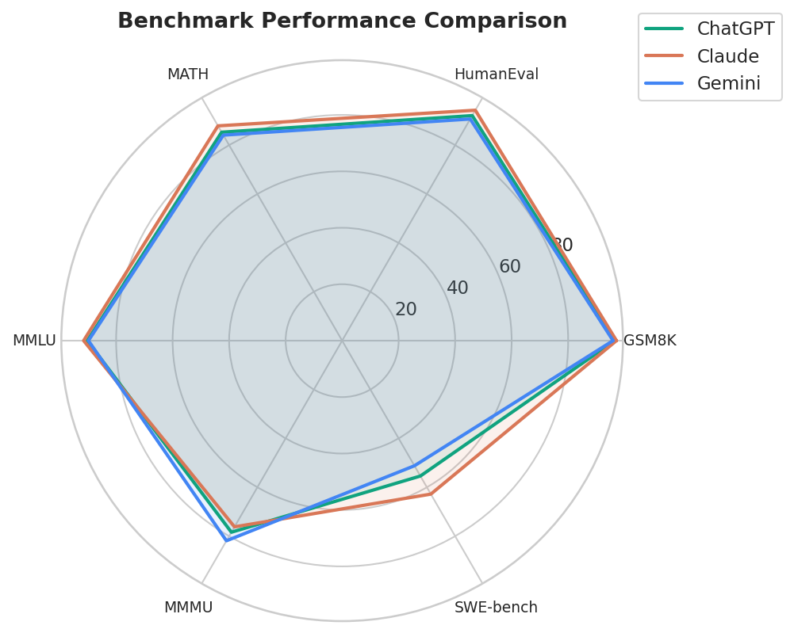
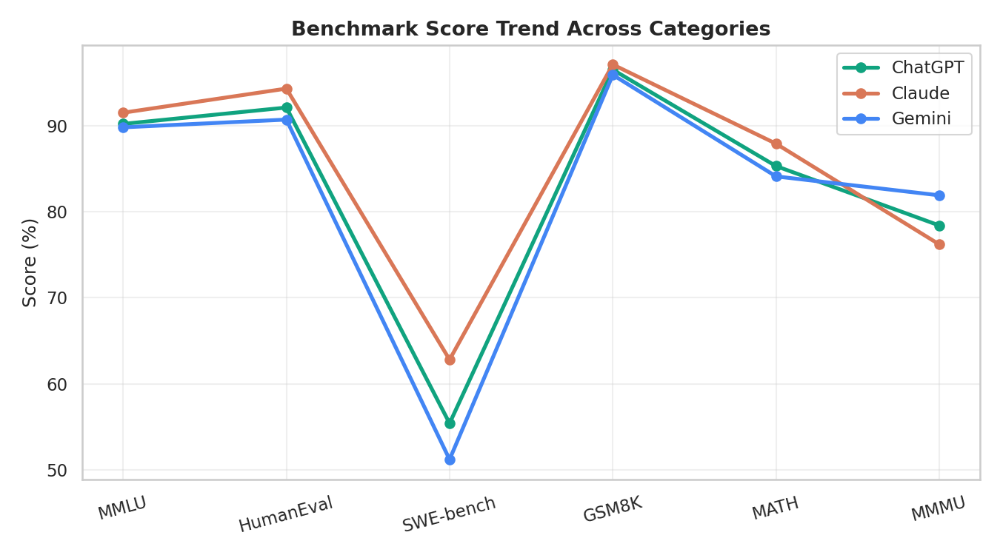
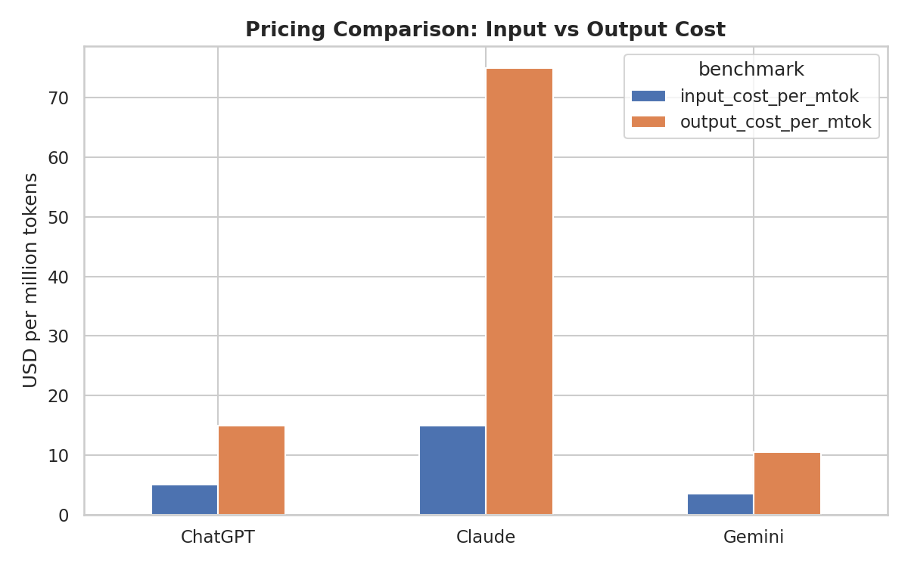
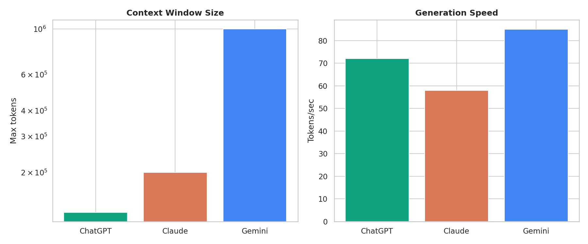
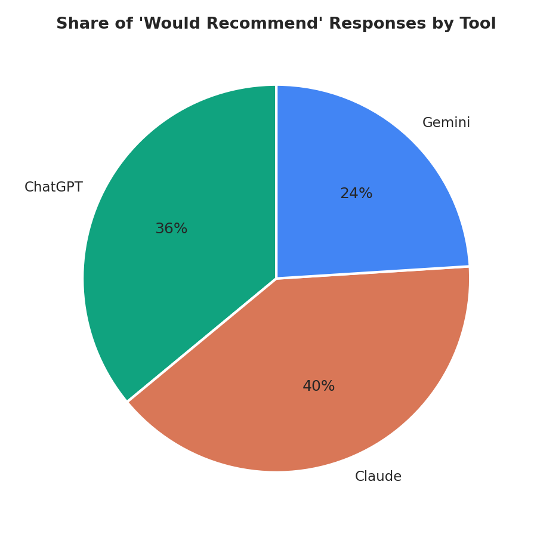
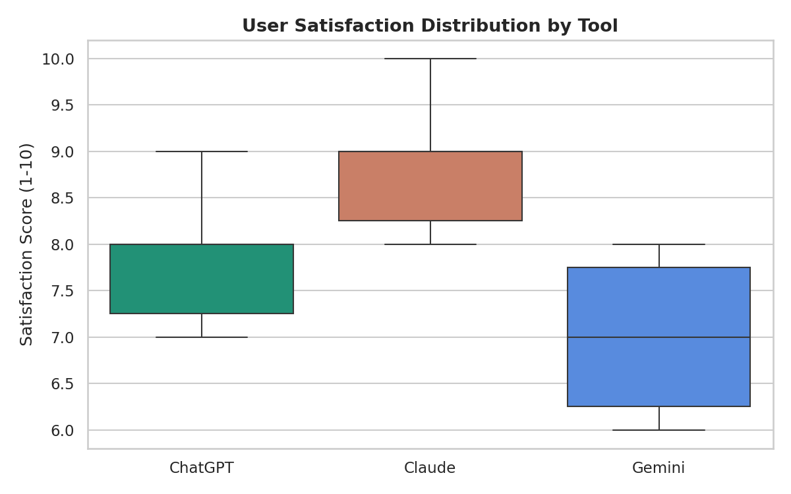
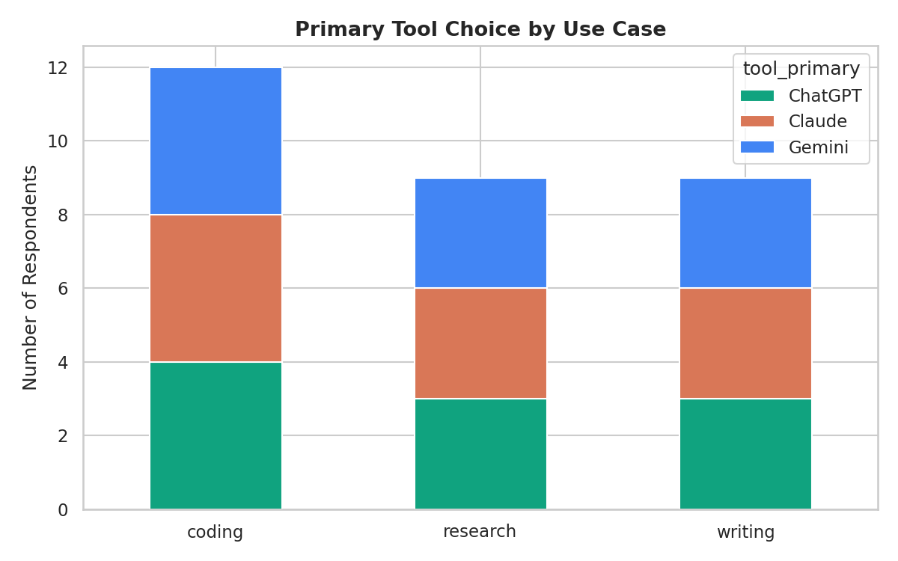

<div align="center">

# 🤖 AI Tools Comparison
### ChatGPT vs Claude vs Gemini

*A data-driven look at how the three leading AI assistants stack up — benchmarks, pricing, speed, and real user satisfaction.*


</div>

---

## 📖 Table of Contents

- [Overview](#-overview)
- [Project Structure](#-project-structure)
- [Dataset Description](#-dataset-description)
- [Visual Insights](#-visual-insights)
- [Getting Started](#-getting-started)
- [Key Findings](#-key-findings)
- [Extending This Project](#️-extending-this-project)
- [License](#-license)

---

## 🔍 Overview

This project compares **ChatGPT (GPT-5.1)**, **Claude (Opus 4.8)**, and **Gemini (2.5 Pro)** across:

| 🧪 Benchmarks | 💰 Pricing | ⚡ Speed & Context | 👥 User Satisfaction |
|:---:|:---:|:---:|:---:|
| MMLU, HumanEval, SWE-bench, GSM8K, MATH, MMMU | Input/output cost per million tokens | Tokens/sec, max context window | 30-respondent survey across 3 use cases |

Every chart below is generated automatically by `src/analyze.py` — run it once and every visual regenerates from the raw CSVs in `data/`.

---

## 📁 Project Structure

```
ai-tools-comparison/
├── data/
│   ├── ai_tools_benchmarks.csv      # Benchmark scores, pricing, context window, speed
│   └── user_survey.csv              # Simulated user survey (satisfaction, use case, etc.)
├── src/
│   └── analyze.py                   # Main analysis script — generates all charts + summary CSVs
├── notebooks/
│   └── exploration.ipynb            # Interactive Jupyter notebook for ad-hoc analysis
├── visuals/                          # Generated PNG charts (created after running analyze.py)
├── reports/                           # Generated summary CSVs (created after running analyze.py)
├── requirements.txt
└── README.md
```

---

## 📊 Dataset Description

<details>
<summary><b>🗂️ ai_tools_benchmarks.csv</b> — click to expand</summary>
<br>

Columns: `tool`, `model_version`, `category`, `benchmark`, `score`, `unit`, `date_recorded`, `source`

Covers:
- **Reasoning** → MMLU
- **Coding** → HumanEval, SWE-bench
- **Math** → GSM8K, MATH
- **Multimodal** → MMMU
- **Context window** → max tokens supported
- **Speed** → tokens/sec generation
- **Pricing** → input/output cost per million tokens

> ⚠️ Benchmark figures are illustrative placeholder values reflecting plausible ranges as of early 2026 — swap in live numbers from vendor docs, [LMSYS Chatbot Arena](https://lmarena.ai), or [Artificial Analysis](https://artificialanalysis.ai) for a production-grade version.

</details>

<details>
<summary><b>🗂️ user_survey.csv</b> — click to expand</summary>
<br>

Columns: `respondent_id`, `tool_primary`, `use_case`, `satisfaction_score`, `ease_of_use`, `accuracy_rating`, `would_recommend`, `monthly_usage_hours`

A 30-respondent simulated survey spanning three use cases: **writing**, **coding**, **research**.

</details>

---

## 📈 Visual Insights

### 🕸️ Benchmark Performance — Radar View
<p align="center"></p>

Claude leads coding and math benchmarks; Gemini pulls ahead on multimodal (MMMU); all three cluster tightly on MMLU reasoning.

---

### 📉 Benchmark Score Trend — Line Chart
<p align="center"></p>

Tracks each tool's score across all six benchmarks side by side — useful for spotting where the gap between tools widens (SWE-bench) versus where they converge (GSM8K).

---

### 💵 Pricing Comparison — Bar Graph
<p align="center"></p>

Gemini is cheapest on input tokens; ChatGPT is cheapest on output tokens; Claude commands a premium at both ends — reflected in its stronger coding benchmark scores.

---

### ⚡ Context Window & Speed
<p align="center"></p>

Gemini's 1M-token context window dwarfs Claude (200K) and ChatGPT (128K), and it also generates the fastest.

---

### 🥧 "Would Recommend" Share — Pie Chart
<p align="center"></p>

Share of survey respondents who'd recommend their primary tool, broken down by which tool they use.

---

### 📦 User Satisfaction Distribution — Box Plot
<p align="center"></p>

Claude shows the highest median satisfaction and the tightest spread — most respondents rated it consistently high.

---

### 🧩 Tool Choice by Use Case — Stacked Bar
<p align="center"></p>

Breaks down which tool respondents reach for across writing, coding, and research tasks.

---

## 🚀 Getting Started

```bash
git clone <your-repo-url>
cd ai-tools-comparison
pip install -r requirements.txt
python src/analyze.py
```

This regenerates everything in `visuals/` and `reports/` from scratch:

| Output | Description |
|---|---|
| `visuals/benchmark_radar.png` | Radar chart of benchmark performance |
| `visuals/benchmark_line_trend.png` | Line chart of scores across categories |
| `visuals/pricing_comparison.png` | Input/output cost bar chart |
| `visuals/context_and_speed.png` | Context window + generation speed |
| `visuals/recommend_share_pie.png` | Pie chart of recommendation share |
| `visuals/satisfaction_boxplot.png` | User satisfaction distribution |
| `visuals/use_case_breakdown.png` | Tool preference by use case |
| `reports/benchmark_pivot.csv` | Tool × benchmark score table |
| `reports/survey_summary.csv` | Aggregated survey stats |

For interactive, cell-by-cell exploration, open `notebooks/exploration.ipynb`.

---

## 🔑 Key Findings

| Dimension | 🏆 Winner | Notes |
|---|:---:|---|
| Coding (SWE-bench, HumanEval) | **Claude** | Consistently leads on agentic coding benchmarks |
| Multimodal (MMMU) | **Gemini** | Strongest vision/multimodal reasoning |
| Context window | **Gemini** | 1M tokens vs 200K (Claude) vs 128K (ChatGPT) |
| Generation speed | **Gemini** | Fastest tokens/sec |
| Cheapest input cost | **Gemini** | $3.50/M tokens |
| Cheapest output cost | **ChatGPT** | $15/M tokens |
| User satisfaction (survey) | **Claude** | Highest avg. satisfaction (8.8/10), especially for coding |
| Best value use case | **ChatGPT** | Most versatile for writing + general use at low cost |

---

## 🛠️ Extending This Project

- 🔄 Replace placeholder benchmark data with live figures from vendor pages or [Artificial Analysis](https://artificialanalysis.ai)
- 🔌 Connect to each provider's API to run your own head-to-head prompt evaluations
- 📐 Add statistical significance testing (t-tests) between survey groups
- 📊 Deploy `analyze.py` outputs to a live dashboard (Streamlit / Plotly Dash)
- 🕒 Add a time-series version to track how benchmarks shift release over release

---

## 📄 License

MIT — free to use and adapt.

<div align="center">

⭐ If this project helped you compare AI tools, consider starring the repo!

</div>
